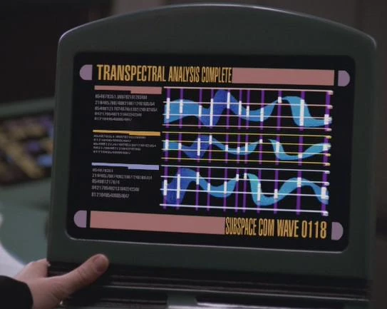

# cargo subspace

<div align="center">



</div>

A tool that forces rust-analyzer to lazily index crates in the workspace as you open new files. It
is useful if you have a very large cargo workspace (think hundreds of crates) and you find that
rust-analyzer can be slow or laggy as a result.

- [A note](#a-note)
- [What the heck is this](#what-the-heck-is-this)
- [Caveats](#caveats)
- [Installation](#installation)
  - [VSCode](#vscode)
  - [neovim](#neovim)
  - [Kate](#kate)
- [Troubleshooting/Debugging](#troubleshooting/debugging)

## A note

**I want to preface all of this by saying that rust-analyzer is an amazing project, and I am
eternally grateful to the many people who contribute to it! It makes developing rust code a breeze,
and it has surely significantly contributed to Rust's widespread adoption.**

## What the heck is this

This tool exists to improve the rust-analyzer experience for very large cargo workspaces.
Cargo workspaces can contain a (theoretically) unbounded number of crates. Many organizations
prefer to maintain a single cargo workspace (e.g. in a monorepo) to keep dependency versions
consistent across different services or libraries and simplify tooling. However, rust-analyzer
indexes the crates in the cargo workspace pretty eagerly, which can take quite a long time.
`check.workspace = false` and `cachePriming.enable = false` can help make things a bit lazier,
but in my experience, they don't solve the problem entirely. Even after indexing is finished,
certain actions, like autocomplete and and finding references to symbols, can be laggy due to the
very large dependency graph.

Rather than allowing rust-analyzer to discover all the crates in the workspace at startup, this
tool tells rust-analyzer about the crates in your workspace selectively as you open new files. It
invokes `cargo metadata` to get the dependency graph for the workspace and then prunes the graph
such that only 1) the crate that owns the current file and 2) that crate's dependencies remain in
the graph. This is supported by rust-analyzer's "rust-project.json" feature, which allows
rust-analyzer to use third party build tools (e.g. bazel or buck) to discover crates in your
project. (This project still uses cargo under the hood, but it integrates into rust-analyzer
through this path.)

## Caveats

Note that, because crates are indexed lazily as you open source code files, you will not be able to
correctly perform any actions that require knowledge of all of the **dependents** of the current
crate (that is, the crates in your workspace that *depend on* the current crate). Some examples
include:

- Finding references to symbols (e.g. functions, types, etc.) defined in the current crate in
  crates that *depend on* the crate (unless you've already opened a file from the dependent crate,
  which means it is already known to rust-analyzer)
- Performing an LSP-powered rename (instances of the symbol in unloaded crates will not be
  correctly renamed, since rust-analyzer has not indexed those crates)

Additionally, symbols defined in unloaded crates will not appear in a symbol search.

## Installation

First, make sure that the `rust-src` component is installed for your rust toolchain. This downloads
the source code for the crates built-in to rust (e.g. `std` and `core`) so rust-analyzer can
properly index them.

```sh
rustup component add rust-src
```

Then:

```sh
cargo install --locked cargo-subspace
```

Next, you need to update the configuration that gets passed to rust-analyzer by your editor (this
step is editor-specific). I've tested it with VSCode, neovim, and Kate, but theoretically, it
should work with any editor that has LSP support.

### VSCode

Add the following to your `settings.json`:

```json
{
  "rust-analyzer.workspace.discoverConfig": {
    "command": [
        "cargo-subspace",
        "discover",
        "{arg}"
    ],
    "progressLabel": "cargo-subspace",
    "filesToWatch": [
        "Cargo.toml"
    ]
  },
  "rust-analyzer.check.overrideCommand": [
    "cargo-subspace",
    "check", // You can also use "clippy" here
    "$saved_file",
  ],
}
```

### neovim

These settings should be set wherever you configure your LSP servers in your neovim config. I use 
the great [rustaceanvim](https://github.com/mrcjkb/rustaceanvim) plugin, but these settings can
also be set via lspconfig.

```lua
["rust-analyzer"] = {
  check = {
    overrideCommand = {
      "cargo-subspace",
      "clippy",
      "$saved_file",
    },
  },
  workspace = {
    discoverConfig = {
      command = {
        "cargo-subspace",
        "discover",
        "{arg}",
      },
      progressLabel = "cargo-subspace",
      filesToWatch = {
        "Cargo.toml",
      },
    },
  },
}
```

### Kate

Kate doesn't seem to include the typical cargo home (`<YOUR HOME DIRECTORY>/.cargo/bin`) directory
on the `PATH` it passes to rust-analyzer, so you'll need to pass the cargo home path to
`cargo-subspace` directly and provide an absolute path to the `cargo-subspace` binary itself.
In the example below, `<CARGO HOME>` should be substituted for an absolute path to the directory
in which your cargo binaries reside (usually, this is `<YOUR HOME DIRECTORY>/.cargo/bin`).

These settings should be specified in `Settings --> LSP Client --> User Server Settings`:

```json
{
  "servers": {
    "rust": {
      "useWorkspace": false,
      "initializationOptions": {
        "check": {
          "allFeatures": true,
          "overrideCommand": [
            "<CARGO HOME>/cargo-subspace",
            "--cargo-home=<CARGO HOME>",
            "clippy",
            "$saved_file"
          ]
        },
        "workspace": {
          "discoverConfig": {
            "command": [
              "<CARGO HOME>/cargo-subspace",
              "--cargo-home=<CARGO HOME>",
              "discover",
              "{arg}"
            ],
            "progressLabel": "cargo-subspace",
            "filesToWatch": [
              "Cargo.toml"
            ]
          }
        }
      }
    }
  }
}
```

Note the `"useWorkspace": false` line; this is required!

## Troubleshooting/Debugging

If you run into trouble, please feel free to open an issue with the following:

- A detailed description of the problem, including steps to reproduce
- Your rust toolchain version
- Your `cargo-subspace` version
- Verbose logs from the errant invocation of this tool (you can collect verbose logs by
  running `cargo-subspace` with the `--verbose` flag). By default, logs are stored in
  `$HOME/.local/state/cargo-subspace/cargo-subspace.log`

You may also feel free to open an issue if you have a feature request. Provided the feature makes
sense and is not too involved, I would be happy to consider it. I'll also accept pull requests if
you're feeling inspired to implement it yourself.

**NOTE:** This project is currently untested on Windows. Please feel free to test it and tell me
about your experience!
